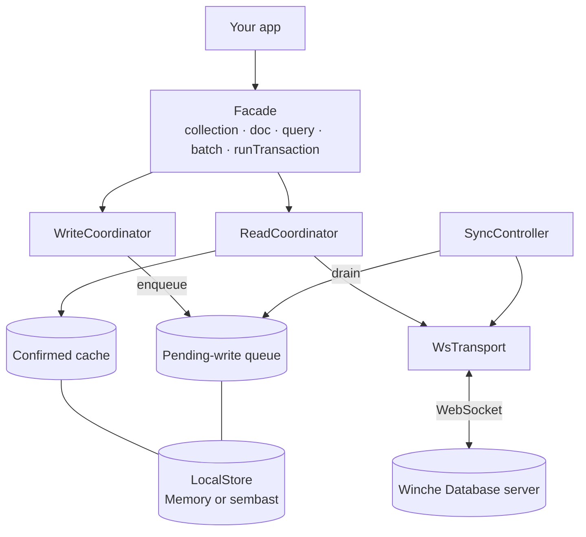
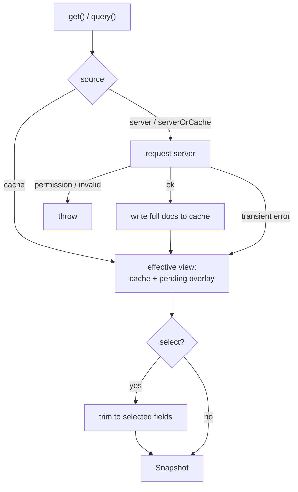
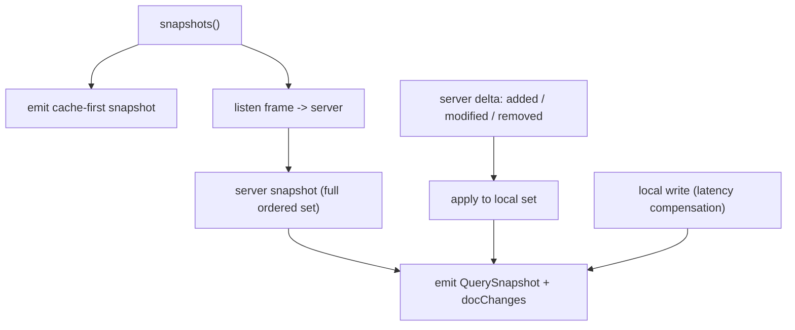
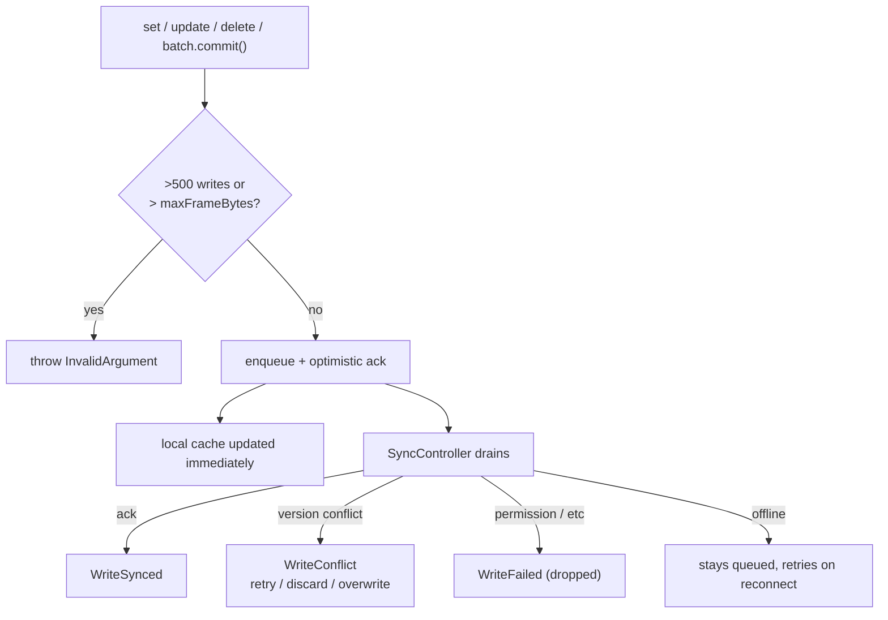
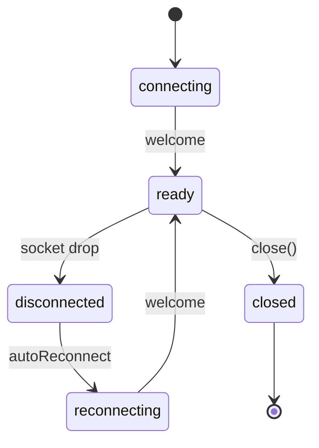

# winche_database

Type-safe Dart client for **Winche Database** — an offline-first, real-time
document store over a single WebSocket connection.

- **Documents & collections** with a fluent reference API
- **Typed values**: null, bool, int, double (incl. `NaN`/`Infinity`), string,
  bytes, timestamp, reference, geo-point, arrays, nested maps
- **Writes**: set (replace, deep-merge, or field-mask via `mergeFields`) /
  update / delete, with field transforms (increment, server timestamp, array
  union/remove, min/max) and preconditions
- **Queries**: filters, ordering, `limit` / `offset` / `limitToLast`, cursors,
  client-side projection, `count`, and aggregations (sum / average)
- **Real-time listeners** for documents and queries
- **Optimistic transactions** with automatic retry
- **Offline-first**: every read is served from a local cache + pending-write
  overlay; every write is queued locally and synced in the background
- **Consistent offline reads**: server-side deletions are reconciled (a deleted
  document never reappears from cache), and `limit` / `offset` / filter queries
  serve their true last-known result set offline — not a re-derivation over the
  whole collection
- **Cross-restart resume & bounded cache**: listeners persist resume tokens and
  query membership (instant cached results on relaunch, efficient resume with no
  full re-download when nothing changed); the cache can optionally be capped by
  document count or byte size — see [Cache management](#cache-management)
- **Durable persistence** (sembast, on by default) or in-memory

For the authoritative wire-protocol specification, see the server repository's
[PROTOCOL.md](https://github.com/FlameOfUdun/Winche-Database/blob/main/docs/PROTOCOL.md).

---

## Architecture

Offline support is always on. Reads return the **effective view** (the confirmed
local cache with un-synced local writes overlaid); writes are appended to a
durable queue and drained to the server by a background sync controller.



---

## Getting started

```dart
import 'package:winche_database/winche_database.dart';

final db = WincheDatabase(
  WincheDatabaseConfig(
    uri: Uri.parse('ws://localhost:5183/documents/ws'),
    tokenProvider: () => currentAuthToken,     // optional
    directoryResolver: () async => appDir,     // required on native (sembast directory)
  ),
);
```

The connection dials lazily on the first operation. Authentication happens at the
WebSocket upgrade via an `?access_token=` query parameter built from
`tokenProvider`. There is **no in-band auth-refresh**: to rotate an expired token,
return the new value from `tokenProvider` — the reconnect path picks it up
automatically.

All options live on `WincheDatabaseConfig`: `uri`, `tokenProvider`, `pingInterval`
(default 30 s), `autoReconnect` (default true), `maxBackoff` (default 30 s),
`maxFrameBytes` (default 1 MiB — see [Writes](#writes-offline-first)), `inMemory`
(default false), `directoryResolver` (sembast directory; see
[Persistence](#persistence)), `conflictPolicy` (default `manual`), and the
optional local-cache caps `maxCachedDocuments` and `cacheSizeBytes` (both default
null = unbounded — see [Cache management](#cache-management)).

---

## Documents & collections

```dart
final users = db.collection('users');
final alice = users.doc('u1');                 // users/u1
final posts = alice.collection('posts');       // users/u1/posts (sub-collection)

final snap = await alice.get();
if (snap.exists) {
  print(snap.data());      // Map<String, Object?>
  print(snap.id);          // 'u1'
  print(snap.version);     // server version
  print(snap.updateTime);  // DateTime
}

await alice.set({'name': 'Alice', 'age': 30});            // replace
await alice.set({'age': 31}, merge: true);                // deep-merge
await alice.set({'age': 31}, mergeFields: ['age']);       // write only masked paths
await alice.update({'address.city': 'Oslo'});             // patch (dotted paths)
await alice.delete();                                     // optionally cascade: true

final ref = await users.add({'name': 'Bob'});             // auto-generated id
```

### Values & field transforms

Native Dart values map to typed wire values: `int`, `double`, `bool`, `String`,
`DateTime` (→ timestamp), `Uint8List` (→ bytes), `GeoPoint`, a
`DocumentReference` (→ reference), `List`, and nested `Map`.

`FieldValue` sentinels express server-side transforms inside `set`/`update`:

```dart
await counter.update({
  'views':    FieldValue.increment(1),
  'seenAt':   FieldValue.serverTimestamp(),
  'tags':     FieldValue.arrayUnion(['featured']),
  'old':      FieldValue.arrayRemove(['draft']),
  'peak':     FieldValue.maximum(99),
  'obsolete': FieldValue.delete(),
});
```

### Preconditions

```dart
await ref.set(data, precondition: const Precondition(exists: false));      // create-only
await ref.update(data, precondition: Precondition.updateTimeRaw(snap.updateTimeRaw!));
```

---

## Reads & sources

Every read goes through the cache. `GetOptions.source` picks the policy:

- `Source.serverOrCache` (default) — read the server, refreshing the cache; on a
  **transient** failure (unavailable / timeout / internal) fall back to cache.
  Actionable errors (`PERMISSION_DENIED`, `UNAUTHENTICATED`, `INVALID_*`) propagate.
- `Source.server` — server only; throws when unreachable.
- `Source.cache` — local only; never contacts the server.



`db.getAll([ref1, ref2])` fetches several documents in one round-trip.

---

## Queries

A `CollectionReference` is itself a query, so builders chain directly:

```dart
final snap = await db.collection('users')
    .where('age', isGreaterThanOrEqualTo: 18)
    .where('active', isEqualTo: true)
    .orderBy('age', descending: true)
    .limit(20)
    .get();

for (final doc in snap.docs) print(doc.data());
print(snap.hasMore); // true if the server had more beyond the limit
```

Filter operators (named args on `where`): `isEqualTo`, `isNotEqualTo`,
`isLessThan`, `isLessThanOrEqualTo`, `isGreaterThan`, `isGreaterThanOrEqualTo`,
`arrayContains`, `arrayContainsAny`, `arrayContainsAll`, `whereIn`, `whereNotIn`,
`contains`, `startsWith`, `endsWith`, `matchesRegex`, `isNull`, `isNan`, `exists`.

`limit(n)` caps the result; `offset(n)` skips leading results; `limitToLast(n)`
returns the last N of an ordered query (requires an `orderBy`, and excludes
`limit`/`offset`). Cursors operate on the `orderBy` keys: `startAt`, `startAfter`,
`endAt`, `endBefore`.

```dart
final page = await db.collection('users').orderBy('name').offset(40).limit(20).get();
final tail = await db.collection('users').orderBy('score').limitToLast(3).get();
```

### Counting & aggregations

`count` and aggregations run **server-side** over a query (online-only; they honor
`where`/`orderBy`/`limit` but reject cursors):

```dart
final n       = await db.collection('users').where('active', isEqualTo: true).count();
final revenue = await db.collection('orders').where('paid', isEqualTo: true).sum('amount');
final rating  = await db.collection('reviews').average('stars');

final agg = await db.collection('orders').aggregate([
  Aggregate.count(alias: 'n'),
  Aggregate.sum('amount', alias: 'revenue'),
]); // → {'n': 12, 'revenue': 840}
```

### Field projection (`select`)

`Query.select([...])` is applied **client-side**. The SDK fetches full documents
(the projection is never sent to the server), caches them normally, and trims
each result to the selected fields locally.

This keeps `select` consistent with the rest of the SDK: results reflect
un-synced local writes and work offline, and the local cache only ever holds
complete documents (never partials). The trade-off is bandwidth — full documents
cross the wire, so `select` is a convenience for shaping results, not a transfer
optimization.

> The server supports server-side projection for other clients; this SDK
> deliberately does not use it, for the consistency reasons above.

---

## Real-time listeners

`snapshots()` returns a stream that emits an immediate cache-first snapshot, then
the server's authoritative snapshot, then incremental updates. `QuerySnapshot`
exposes `docs` and `docChanges` (added / modified / removed).

```dart
final sub = db.collection('users')
    .where('active', isEqualTo: true)
    .orderBy('name')
    .snapshots()
    .listen((qs) {
      for (final c in qs.docChanges) {
        print('${c.type} ${c.doc.id} @${c.newIndex}');
      }
    });

final docSub = db.doc('users/u1').snapshots().listen((s) => print(s.data()));
```



A permanently-failing subscription (`PERMISSION_DENIED` / `UNAUTHENTICATED` /
invalid query) surfaces the error on the stream and stops retrying; transient
drops reconnect silently. Server-side deletions are reconciled into the local
cache (a deleted document never reappears), and with durable persistence a
listener resumes across app restarts — see [Cache management](#cache-management).

---

## Writes, offline-first

Writes are **local-first**: `set` / `update` / `delete` append to a durable queue
and return an optimistic acknowledgement immediately. The local cache reflects
the change at once (latency compensation), and the `SyncController` drains the
queue to the server in the background. Watch `db.syncEvents` for the outcome.



```dart
db.syncEvents.listen((e) {
  if (e is WriteSynced) {
    // server acknowledged the write
  } else if (e is WriteConflict) {
    // ConflictPolicy.manual (default): resolve explicitly
    e.discard(); // or e.retry() / e.overwrite()
  } else if (e is WriteFailed) {
    // permanent (e.g. permission denied); dropped from the queue
    print(e.error);
  }
});

await db.waitForPendingWrites();   // see the manual-conflict caveat in the API docs
final pending = await db.hasPendingWrites;
await db.clearPersistence();       // wipe local cache + queue
```

Conflict handling is governed by `WincheDatabaseConfig.conflictPolicy`:
`manual` (default — pause and surface a `WriteConflict` for explicit
resolution), `clientWins` (replay the local write, last-write-wins), or
`serverWins` (drop the local write, keep the server's). Under the automatic
policies a conflict that can never be resolved — e.g. an `update` to a document
that has since been deleted, which always fails with `NOT_FOUND` — is reported
as a `WriteFailed` and removed from the queue rather than retried forever.

> **Frame guard:** a batch over 500 writes, or whose serialized frame exceeds
> `maxFrameBytes` (default 1 MiB), is rejected with `InvalidArgumentException`
> *before* it enters the queue — so it never loops on the wire.

### Batches

```dart
final batch = db.batch()
  ..set(db.doc('users/u1'), {'name': 'Alice'})
  ..update(db.doc('users/u2'), {'active': false})
  ..delete(db.doc('users/u3'));
await batch.commit(); // atomic
```

---

## Transactions

`runTransaction` runs reads-then-writes atomically and retries automatically on
conflict. Reads (`tx.get` / `tx.query`) must precede writes. Transactions are
**online-only**.

```dart
final newBalance = await db.runTransaction((tx) async {
  final snap = await tx.get(db.doc('accounts/a1'));
  final balance = (snap.data()!['balance'] as int) - 100;
  tx.update(db.doc('accounts/a1'), {'balance': balance});
  return balance;
});
```

---

## Connection & errors

```dart
db.connectionState;                 // ConnectionState.ready, .disconnected, ...
db.connectionStates.listen(...);    // transitions (survives reconnects)
db.reconnects.listen(...);          // fires on each successful reconnect
```



The client reconnects automatically on any drop (network loss, server restart,
any close code). The only way to reach `closed` is by calling `close()`.

Operations throw a `WincheException` subclass on failure:
`PermissionDeniedException`, `UnauthenticatedException`, `NotFoundException`,
`AlreadyExistsException`, `FailedPreconditionException`, `AbortedException`,
`InvalidQueryException` (with `jsonPath` / `code`), `InvalidArgumentException`,
`DeadlineExceededException`, `InternalException`, `UnavailableException`.

---

## Persistence

Persistence is **on by default** via sembast. The sembast directory is resolved lazily
on first store access from `WincheDatabaseConfig.directoryResolver` — **required
on native** platforms, ignored on the web (which uses IndexedDB):

```dart
final db = WincheDatabase(WincheDatabaseConfig(
  uri: uri,
  directoryResolver: () async => (await getApplicationDocumentsDirectory()).path,
));
```

For a non-durable in-memory store (state lost on exit), set `inMemory: true`
(then `directoryResolver` must be omitted):

```dart
final db = WincheDatabase(WincheDatabaseConfig(uri: uri, inMemory: true));
```

Advanced / testing: inject a custom `LocalStore` (using the lower-level
`ConnectionConfig`) with `WincheDatabase.withStore(connectionConfig, store)`.

---

## Cache management

The local cache stays consistent with the server and can be bounded.

**Deletion reconciliation.** When a document is deleted on the server, the SDK
tombstones it locally, so it disappears from every listener, `get`, and cache
read and never resurfaces — online or offline.

**Membership-based offline reads.** Each live query remembers the exact set of
documents the server last reported for it. Offline reads and a listener's
cache-first emission serve that set (resolved against the cache + pending
overlay), so `limit` / `offset` / filter queries stay correct offline instead of
re-deriving over the whole collection.

**Resume across restarts.** With durable persistence (the default), listeners
persist their resume token and query membership. On relaunch a listener emits its
last-known results immediately and resumes the server subscription with the
stored token: if nothing changed it goes live without re-downloading; if the
token is stale the server sends a fresh snapshot. (With `inMemory: true`, resume
state lasts only for the session.)

**Bounded cache (optional, off by default).** Set `maxCachedDocuments` and/or
`cacheSizeBytes` to cap the cache. When a cap is exceeded, the least-recently-used
documents that are **not** referenced by an active listener or a pending write are
evicted. Eviction is not a deletion — an evicted document is simply re-fetched on
its next read (deleted documents stay tombstoned). A configured cap is also
enforced against already-persisted documents on startup.

```dart
final db = WincheDatabase(WincheDatabaseConfig(
  uri: uri,
  directoryResolver: () async => appDir,
  cacheSizeBytes: 50 * 1024 * 1024,   // ~50 MiB cap (or maxCachedDocuments: 10000)
));
```

> A document deleted while the app is fully offline reconciles on the next
> reconnect or read, not instantly. On native/desktop a persistent store must be
> owned by a single isolate.

---

## Platform notes

- **Web int precision:** Dart integers compiled to JavaScript are limited to
  2^53; larger int64 values from the server lose precision on web.
- Offline array-membership transforms use type-naive equality and are reconciled
  by the server acknowledgement.
