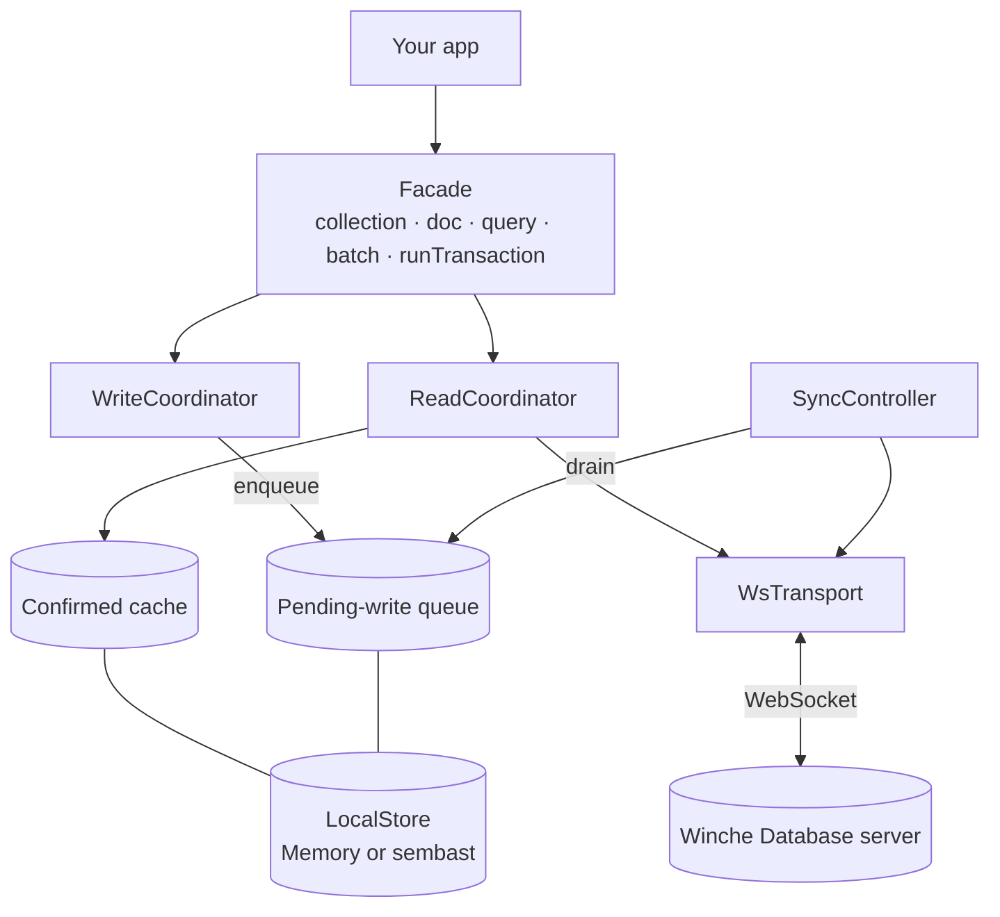
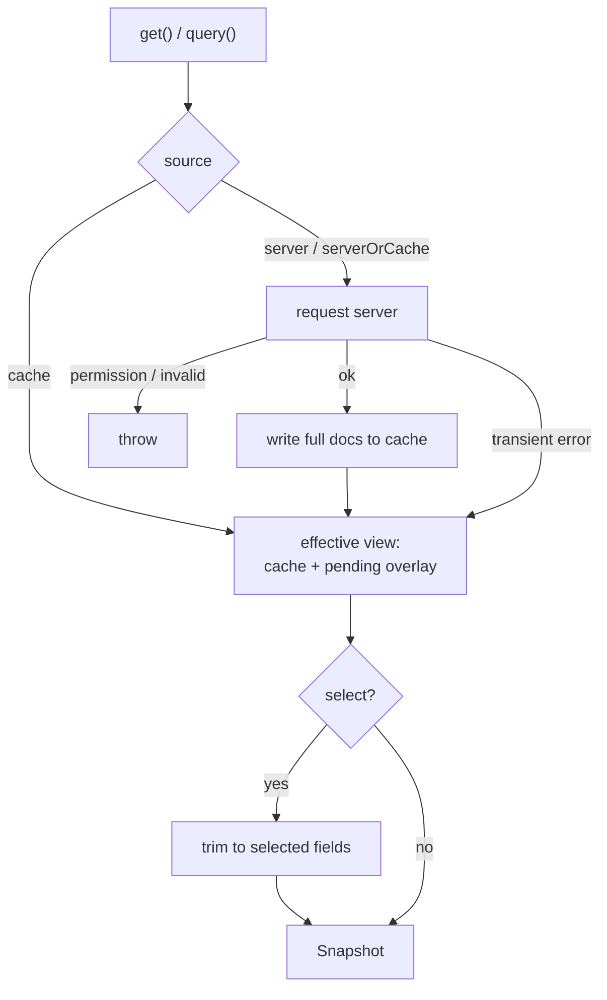
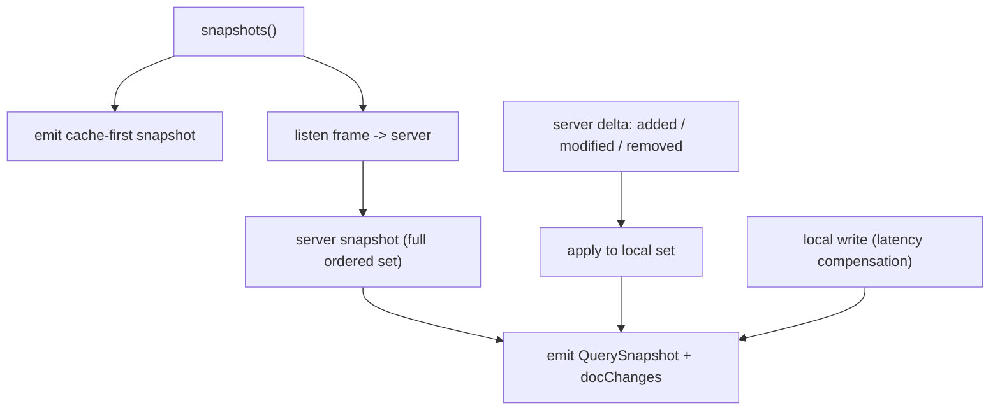
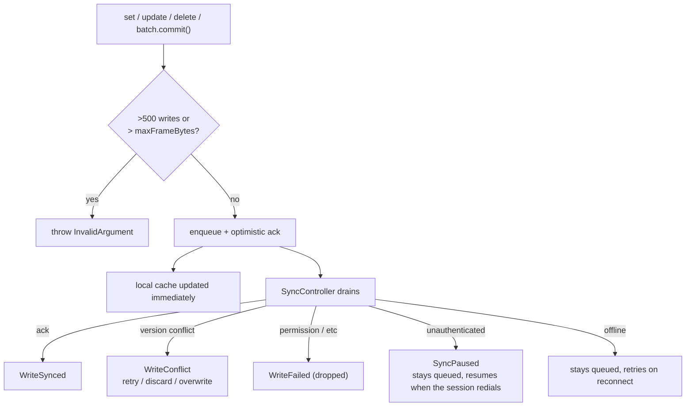
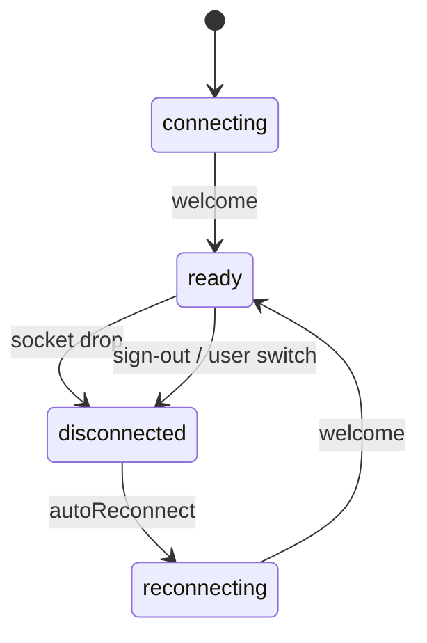

# winche_database

Type-safe Dart client for **Winche Database** — an offline-first, real-time
document store over a single WebSocket connection.

- **Documents & collections** with a fluent reference API
- **Typed values**: null, bool, int, double (incl. `NaN`/`Infinity`), string,
  bytes, timestamp, reference, geo-point, arrays, nested maps
- **Writes**: set (replace, deep-merge, or field-mask via `mergeFields`) /
  update / delete, with field transforms (increment, server timestamp, array
  union/remove, min/max) and preconditions
- **Queries**: filters, ordering, `limit` / `offset` / `limitToLast`, cursors,
  client-side projection, `count`, and aggregations (sum / average)
- **Real-time listeners** for documents and queries
- **Optimistic transactions** with automatic retry
- **Offline-first**: every read is served from a local cache + pending-write
  overlay; every write is queued locally and synced in the background
- **Consistent offline reads**: server-side deletions are reconciled (a deleted
  document never reappears from cache), and `limit` / `offset` / filter queries
  serve their true last-known result set offline — not a re-derivation over the
  whole collection
- **Cross-restart resume & bounded cache**: listeners persist resume tokens and
  query membership (instant cached results on relaunch, efficient resume with no
  full re-download when nothing changed); the cache can optionally be capped by
  document count or byte size — see [Cache management](#cache-management)
- **Durable persistence** (sembast, on by default) or in-memory

For the authoritative wire-protocol specification, see the server repository's
[PROTOCOL.md](https://github.com/FlameOfUdun/Winche-Database/blob/main/docs/PROTOCOL.md).

---

## Architecture

Offline support is always on. Reads return the **effective view** (the confirmed
local cache with un-synced local writes overlaid); writes are appended to a
durable queue and drained to the server by a background sync controller.


```mermaid
flowchart TD
  App[Your app] --> Facade["Facade<br/>collection · doc · query · batch · runTransaction"]
  Facade --> Reads[ReadCoordinator]
  Facade --> Writes[WriteCoordinator]
  Reads --> Cache[(Confirmed cache)]
  Writes -- enqueue --> Queue[(Pending-write queue)]
  Sync[SyncController] -- drain --> Queue
  Reads --> T[WsTransport]
  Sync --> T
  T <-->|WebSocket| Server[(Winche Database server)]
  Cache --- Store[(LocalStore<br/>Memory or sembast)]
  Queue --- Store
```

---

## Getting started

`winche_database` is a consumer service on top of `winche_core`: it does not dial
anything or open a store until an identity is signed in, and it does not carry a
sign-in surface of its own — that is a `WincheAuthService`'s job (a real backend
package, or `ScriptedAuthService` from `package:winche_core/testing.dart` for
tests and samples). Set up core once at startup, then reach the database
anywhere:

```dart
import 'package:winche_core/winche_core.dart';
import 'package:winche_database/winche_database.dart';

Winche.initializeApp(
  options: WincheOptions(
    databaseEndpoint: Uri.parse('ws://localhost:5183/documents/ws'),
    directoryResolver: () async => appDir,   // required on native (sembast root)
  ),
);

final db = WincheDatabase.instance;
```

Some auth package then registers itself against the same app (e.g.
`MyAuthService(Winche.app)`) and announces identity changes; `db` binds to
whichever identity is currently signed in and rebuilds automatically on every
sign-in, sign-out and user switch. This package never sees a token directly —
it reads one from the current session on every (re)dial.

Tuning that has nothing to do with *which* backend or *which* identity lives on
`WincheDatabaseConfig`, set right after obtaining the instance:

```dart
db.config = const WincheDatabaseConfig(
  pingInterval: const Duration(seconds: 30),   // default
  autoReconnect: true,                          // default
  maxBackoff: const Duration(seconds: 30),      // default
  maxFrameBytes: 1 << 20,                       // default 1 MiB — see Writes
  inMemory: false,                              // default
  conflictPolicy: ConflictPolicy.manual,        // default
  maxCachedDocuments: null,                     // default — see Cache management
  cacheSizeBytes: null,                         // default — see Cache management
);
```

Every field defaults, so `const WincheDatabaseConfig()` (equivalently, never
touching `config`) is a valid, fully-working configuration. Setting `config`
**throws a `StateError` once the database has been used** — once any member has
opened its store or dialled its socket. This works on the line right after
`.instance` because construction is lazy: obtaining the instance never itself
counts as a use. Set it once, immediately, and never again on that instance.

### What throws while nobody is signed in

Before the first sign-in, and again after a sign-out, there is no session to
serve reads, queue writes, or hold a store — the store is per-identity, so there
is nothing to buffer into. Every operation that needs one throws
`WincheUnboundException`.

**Nuance:** `db.doc(...)` and `db.batch()` are lazy factories — building a
reference or a batch is synchronous local bookkeeping and does not touch the
session, so they never throw. The exception surfaces on the first call that
actually needs the session: `.get()`, `.set()`, `.update()`, `.delete()`,
`.commit()`, `runTransaction`, and so on. This lets you build references and
queries eagerly (e.g. at widget construction time) and only worry about the
unbound state where you actually await something.

`.snapshots()` reports it differently, because a stream has somewhere better to
put an error than the call site. Calling it while unbound returns normally; the
returned stream then emits `WincheUnboundException` as a **stream error** and
closes. That matters because the call site is typically inside a `build()`
method, where throwing tears down the widget tree instead of reaching a
`StreamBuilder`'s `hasError` branch.

```dart
StreamBuilder(
  stream: db.collection('tasks').snapshots(),   // safe while signed out
  builder: (context, snapshot) {
    if (snapshot.hasError) return const Text('Sign in to see your tasks');
    ...
  },
);
```

`WincheUnboundException` lives in `winche_core` and is imported from there —
`package:winche_core/winche_core.dart`, which an app using this SDK already
imports for `Winche.initializeApp`. This package does not re-export it: "nobody
is signed in" is a stack-wide condition core owns, not one `winche_database`
defines.

It is deliberately **not** a `WincheProtocolException` — it never crosses the
wire, so it does not belong in the backend-error hierarchy, and `on
WincheProtocolException` will not catch it. It *is* a `WincheException`, core's
root for the whole stack, so `on WincheException` will. That is the distinction
worth knowing: the root answers "did any Winche SDK fail?", which is rarely the
question you want here. Being signed out is not an error to retry or surface
next to a `PERMISSION_DENIED`; it is fixed by signing in. Gate on sign-in state
(your auth package's own identity/session surface, e.g. a
`WincheAuthService.activeIdentity`) rather than catching this exception at call
sites.

---

## Documents & collections

```dart
final users = db.collection('users');
final alice = users.doc('u1');                 // users/u1
final posts = alice.collection('posts');       // users/u1/posts (sub-collection)

final snap = await alice.get();
if (snap.exists) {
  print(snap.data());      // Map<String, Object?>
  print(snap.id);          // 'u1'
  print(snap.version);     // server version
  print(snap.updateTime);  // DateTime
}

await alice.set({'name': 'Alice', 'age': 30});            // replace
await alice.set({'age': 31}, merge: true);                // deep-merge
await alice.set({'age': 31}, mergeFields: ['age']);       // write only masked paths
await alice.update({'address.city': 'Oslo'});             // patch (dotted paths)
await alice.delete();                                     // optionally cascade: true

final ref = await users.add({'name': 'Bob'});             // auto-generated id
```

### Values & field transforms

Native Dart values map to typed wire values: `int`, `double`, `bool`, `String`,
`DateTime` (→ timestamp), `Uint8List` (→ bytes), `GeoPoint`, a
`DocumentReference` (→ reference), `List`, and nested `Map`.

`FieldValue` sentinels express server-side transforms inside `set`/`update`:

```dart
await counter.update({
  'views':    FieldValue.increment(1),
  'seenAt':   FieldValue.serverTimestamp(),
  'tags':     FieldValue.arrayUnion(['featured']),
  'old':      FieldValue.arrayRemove(['draft']),
  'peak':     FieldValue.maximum(99),
  'obsolete': FieldValue.delete(),
});
```

### Preconditions

```dart
await ref.set(data, precondition: const Precondition(exists: false));      // create-only
await ref.update(data, precondition: Precondition.updateTimeRaw(snap.updateTimeRaw!));
```

---

## Reads & sources

Every read goes through the cache. `GetOptions.source` picks the policy:

- `Source.serverOrCache` (default) — read the server, refreshing the cache; on a
  **transient** failure (unavailable / timeout / internal) fall back to cache.
  Actionable errors (`PERMISSION_DENIED`, `UNAUTHENTICATED`, `INVALID_*`) propagate.
- `Source.server` — server only; throws when unreachable.
- `Source.cache` — local only; never contacts the server.


```mermaid
flowchart TD
  A["get() / query()"] --> S{source}
  S -->|cache| EV
  S -->|server / serverOrCache| Req[request server]
  Req -->|ok| WT["write full docs to cache"] --> EV
  Req -->|transient error| EV["effective view:<br/>cache + pending overlay"]
  Req -->|permission / invalid| Err[throw]
  EV --> Sel{select?}
  Sel -->|yes| Proj["trim to selected fields"] --> Out[Snapshot]
  Sel -->|no| Out[Snapshot]
```

`db.getAll([ref1, ref2])` fetches several documents in one round-trip.

---

## Queries

A `CollectionReference` is itself a query, so builders chain directly:

```dart
final snap = await db.collection('users')
    .where('age', isGreaterThanOrEqualTo: 18)
    .where('active', isEqualTo: true)
    .orderBy('age', descending: true)
    .limit(20)
    .get();

for (final doc in snap.docs) print(doc.data());
print(snap.hasMore); // true if the server had more beyond the limit
```

Filter operators (named args on `where`): `isEqualTo`, `isNotEqualTo`,
`isLessThan`, `isLessThanOrEqualTo`, `isGreaterThan`, `isGreaterThanOrEqualTo`,
`arrayContains`, `arrayContainsAny`, `arrayContainsAll`, `whereIn`, `whereNotIn`,
`contains`, `startsWith`, `endsWith`, `matchesRegex`, `isNull`, `isNan`, `exists`.

`limit(n)` caps the result; `offset(n)` skips leading results; `limitToLast(n)`
returns the last N of an ordered query (requires an `orderBy`, and excludes
`limit`/`offset`). Cursors operate on the `orderBy` keys: `startAt`, `startAfter`,
`endAt`, `endBefore`.

```dart
final page = await db.collection('users').orderBy('name').offset(40).limit(20).get();
final tail = await db.collection('users').orderBy('score').limitToLast(3).get();
```

### Counting & aggregations

`count` and aggregations run **server-side** over a query (online-only; they honor
`where`/`orderBy`/`limit` but reject cursors):

```dart
final n       = await db.collection('users').where('active', isEqualTo: true).count();
final revenue = await db.collection('orders').where('paid', isEqualTo: true).sum('amount');
final rating  = await db.collection('reviews').average('stars');

final agg = await db.collection('orders').aggregate([
  Aggregate.count(alias: 'n'),
  Aggregate.sum('amount', alias: 'revenue'),
]); // → {'n': 12, 'revenue': 840}
```

### Field projection (`select`)

`Query.select([...])` is applied **client-side**. The SDK fetches full documents
(the projection is never sent to the server), caches them normally, and trims
each result to the selected fields locally.

This keeps `select` consistent with the rest of the SDK: results reflect
un-synced local writes and work offline, and the local cache only ever holds
complete documents (never partials). The trade-off is bandwidth — full documents
cross the wire, so `select` is a convenience for shaping results, not a transfer
optimization.

> The server supports server-side projection for other clients; this SDK
> deliberately does not use it, for the consistency reasons above.

---

## Real-time listeners

`snapshots()` returns a stream that emits an immediate cache-first snapshot, then
the server's authoritative snapshot, then incremental updates. `QuerySnapshot`
exposes `docs` and `docChanges` (added / modified / removed).

```dart
final sub = db.collection('users')
    .where('active', isEqualTo: true)
    .orderBy('name')
    .snapshots()
    .listen((qs) {
      for (final c in qs.docChanges) {
        print('${c.type} ${c.doc.id} @${c.newIndex}');
      }
    });

final docSub = db.doc('users/u1').snapshots().listen((s) => print(s.data()));
```


```mermaid
flowchart TD
  Sub["snapshots()"] --> CF["emit cache-first snapshot"]
  Sub --> L["listen frame -> server"]
  L --> Snap["server snapshot (full ordered set)"] --> E["emit QuerySnapshot + docChanges"]
  D["server delta: added / modified / removed"] --> A[apply to local set] --> E
  W["local write (latency compensation)"] --> E
```

A permanently-failing subscription (`PERMISSION_DENIED` / `UNAUTHENTICATED` /
invalid query) surfaces the error on the stream and stops retrying; transient
drops reconnect silently. Server-side deletions are reconciled into the local
cache (a deleted document never reappears), and with durable persistence a
listener resumes across app restarts — see [Cache management](#cache-management).

A `snapshots()` stream also completes on a user switch — see
[Streams and user switches](#streams-and-user-switches).

---

## Writes, offline-first

Writes are **local-first**: `set` / `update` / `delete` append to a durable queue
and return an optimistic acknowledgement immediately. The local cache reflects
the change at once (latency compensation), and the `SyncController` drains the
queue to the server in the background. Watch `db.syncEvents` for the outcome.


```mermaid
flowchart TD
  W["set / update / delete / batch.commit()"] --> G{">500 writes or<br/>> maxFrameBytes?"}
  G -->|yes| R[throw InvalidArgument]
  G -->|no| Q["enqueue + optimistic ack"]
  Q --> LC["local cache updated immediately"]
  Q --> Dr[SyncController drains]
  Dr -->|ack| SY["WriteSynced"]
  Dr -->|version conflict| CO["WriteConflict<br/>retry / discard / overwrite"]
  Dr -->|permission / etc| FA["WriteFailed (dropped)"]
  Dr -->|unauthenticated| PA["SyncPaused<br/>stays queued, resumes when the session redials"]
  Dr -->|offline| OF["stays queued, retries on reconnect"]
```

```dart
db.syncEvents.listen((e) {
  if (e is WriteSynced) {
    // server acknowledged the write
  } else if (e is WriteConflict) {
    // ConflictPolicy.manual (default): resolve explicitly
    e.discard(); // or e.retry() / e.overwrite()
  } else if (e is WriteFailed) {
    // permanent (e.g. permission denied); dropped from the queue.
    // e.writes carries the dropped entries in full — this is the only place
    // they still exist, so capture them here if the work matters.
    print(e.error);
  } else if (e is SyncPaused) {
    // The token is dead; nothing was dropped. This package has no reconnect()
    // of its own any more — refresh the token in your auth service and
    // announce it there; core re-dials the session automatically, and the
    // drain resumes on its own once the socket is back up.
    print(e.error);
  }
});

await db.waitForPendingWrites();   // see the manual-conflict caveat in the API docs
final pending = await db.hasPendingWrites;
await db.clearPersistence();       // wipe local cache + queue
```

Conflict handling is governed by `WincheDatabaseConfig.conflictPolicy`:
`manual` (default — pause and surface a `WriteConflict` for explicit
resolution), `clientWins` (replay the local write, last-write-wins), or
`serverWins` (drop the local write, keep the server's). Under the automatic
policies a conflict that can never be resolved — e.g. an `update` to a document
that has since been deleted, which always fails with `NOT_FOUND` — is reported
as a `WriteFailed` and removed from the queue rather than retried forever.

> **Frame guard:** a batch over 500 writes, or whose serialized frame exceeds
> `maxFrameBytes` (default 1 MiB), is rejected with `InvalidArgumentException`
> *before* it enters the queue — so it never loops on the wire.

### Batches

```dart
final batch = db.batch()
  ..set(db.doc('users/u1'), {'name': 'Alice'})
  ..update(db.doc('users/u2'), {'active': false})
  ..delete(db.doc('users/u3'));
await batch.commit(); // atomic
```

---

## Transactions

`runTransaction` runs reads-then-writes atomically and retries automatically on
conflict. Reads (`tx.get` / `tx.query`) must precede writes. Transactions are
**online-only**.

```dart
final newBalance = await db.runTransaction((tx) async {
  final snap = await tx.get(db.doc('accounts/a1'));
  final balance = (snap.data()!['balance'] as int) - 100;
  tx.update(db.doc('accounts/a1'), {'balance': balance});
  return balance;
});
```

---

## Connection & errors

```dart
db.connectionState;                 // ConnectionState.ready, .disconnected, ...
db.connectionStates.listen(...);    // transitions (survives user switches)
db.reconnects.listen(...);          // fires on each successful reconnect
```


```mermaid
stateDiagram-v2
  [*] --> connecting
  connecting --> ready: welcome
  ready --> disconnected: socket drop
  disconnected --> reconnecting: autoReconnect
  reconnecting --> ready: welcome
  ready --> disconnected: sign-out / user switch
```

The client reconnects automatically on any drop (network loss, server restart,
any close code, or an expired token — core re-reads the session's token and
redials on its own once a fresh one is available). There is no `close()` or
`reconnect()` to call yourself any more: the session backing `db` is entirely
owned by `winche_core`, built the moment an identity signs in and torn down the
moment it signs out or is replaced.

---

### Streams and user switches

Three streams — `connectionStates`, `syncEvents`, `reconnects` — describe the
*connection*, not any particular user's data, so they **survive** a sign-out or
a user switch: they go quiet (`connectionStates` emits
`ConnectionState.disconnected`) rather than ending. A connection banner or a
"syncing…" indicator subscribed once at app startup keeps working across every
sign-in for the life of the app.

`snapshots()`, by contrast, **completes** (`onDone`) on a user switch. A
`QueryReference`/`DocumentReference` listener is showing *one identity's*
documents; if it silently kept running across a switch, a widget built for
Alice would start rendering Bob's data with no signal anywhere that anything
changed. Completing the stream forces the normal Dart/Flutter idiom — the
widget that built the subscription notices it ended and resubscribes — rather
than leaving stale data on screen. In practice this falls out naturally: the
same rebuild that already happens when your app's sign-in state changes (e.g. a
`StreamBuilder` over your auth package's identity stream) is what tears down the
old `snapshots()` subscription and starts a new one.

---

Operations throw a `WincheProtocolException` subclass on failure:
`PermissionDeniedException`, `UnauthenticatedException`, `NotFoundException`,
`AlreadyExistsException`, `FailedPreconditionException`, `AbortedException`,
`InvalidQueryException` (with `jsonPath` / `code`), `InvalidArgumentException`,
`DeadlineExceededException`, `InternalException`, `UnavailableException`.

`WincheProtocolException` extends `WincheException`, core's root for the whole
stack. Catch the former for "the database backend rejected this" and the latter
for "any Winche SDK failed" — they are different questions, and the narrower
one is usually the one you want.

Calling anything before sign-in, or after a sign-out, throws
`WincheUnboundException` instead — see
[What throws while nobody is signed in](#what-throws-while-nobody-is-signed-in).
It is a `WincheException` but not a `WincheProtocolException`, so
`on WincheProtocolException` will not catch it.

---

## Persistence

Persistence is **on by default** via sembast. The sembast root is resolved
lazily on first store access from `WincheOptions.directoryResolver` — **required
on native** platforms for a persistent store, ignored on the web (which uses
IndexedDB):

```dart
Winche.initializeApp(
  options: WincheOptions(
    databaseEndpoint: uri,
    directoryResolver: () async =>
        (await getApplicationDocumentsDirectory()).path,
  ),
);
```

Each signed-in identity gets its own store on disk, at
`<root>/winche/<storageKey>/database/index.db`. The layout is stack-wide: every
Winche package shares the per-identity directory and takes one subdirectory of
its own beneath it, each holding an `index.db`, so `winche_storage` sits
alongside at `<root>/winche/<storageKey>/storage/`. Forgetting a user is
therefore a single recursive delete of `<root>/winche/<storageKey>`, whatever
mix of Winche packages the app uses.

`storageKey`, not the raw identity id — see `WincheIdentity.storageKey`. It is
a SHA-256 digest, so ids differing only in case cannot collide on a
case-insensitive filesystem, any id shape yields a usable path, and the user's
id never lands on disk.

`<root>` is core's `directoryResolver`, shared by every Winche service under
the app; `winche_database` only decides the part beneath it.

On the web there are no directories, so the same three parts — scope, identity,
package — are flattened into one IndexedDB database name,
`winche_<storageKey>_database`.

For a non-durable in-memory store (state lost on exit), set `inMemory: true` on
`WincheDatabaseConfig` (then `directoryResolver` is never consulted):

```dart
db.config = const WincheDatabaseConfig(inMemory: true);
```

---

## Cache management

The local cache stays consistent with the server and can be bounded.

**Deletion reconciliation.** When a document is deleted on the server, the SDK
tombstones it locally, so it disappears from every listener, `get`, and cache
read and never resurfaces — online or offline.

**Membership-based offline reads.** Each live query remembers the exact set of
documents the server last reported for it. Offline reads and a listener's
cache-first emission serve that set (resolved against the cache + pending
overlay), so `limit` / `offset` / filter queries stay correct offline instead of
re-deriving over the whole collection.

**Resume across restarts.** With durable persistence (the default), listeners
persist their resume token and query membership. On relaunch a listener emits its
last-known results immediately and resumes the server subscription with the
stored token: if nothing changed it goes live without re-downloading; if the
token is stale the server sends a fresh snapshot. (With `inMemory: true`, resume
state lasts only for the session.)

**Bounded cache (optional, off by default).** Set `maxCachedDocuments` and/or
`cacheSizeBytes` to cap the cache. When a cap is exceeded, the least-recently-used
documents that are **not** referenced by an active listener or a pending write are
evicted. Eviction is not a deletion — an evicted document is simply re-fetched on
its next read (deleted documents stay tombstoned). A configured cap is also
enforced against already-persisted documents on startup.

```dart
db.config = const WincheDatabaseConfig(
  cacheSizeBytes: 50 * 1024 * 1024,   // ~50 MiB cap (or maxCachedDocuments: 10000)
);
```

> A document deleted while the app is fully offline reconciles on the next
> reconnect or read, not instantly. On native/desktop a persistent store must be
> owned by a single isolate.

---

## Platform notes

- **Web int precision:** Dart integers compiled to JavaScript are limited to
  2^53; larger int64 values from the server lose precision on web.
- Offline array-membership transforms use type-naive equality and are reconciled
  by the server acknowledgement.
